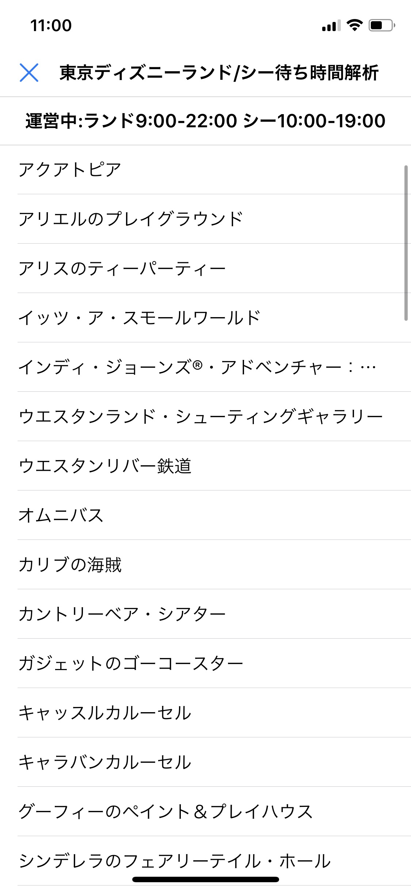
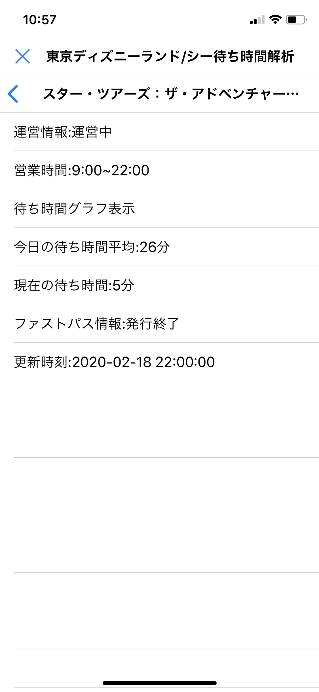

# 東京ディズニーリゾート待ち時間測定アプリ


  
バッチで遊んでみました.
## 最新情報
2020/02/16:実装済み機能2のクエリ不具合修正
## 内容
東京ディズニーリゾートでのアトラクション混雑を少しでも減らせるように一日の待ち時間の流れ瞬時に可視化し,現在そのアトラクションが空いているのか,混雑しているのか判断することのできるアプリを到達点に開発中です.
### 実装済み機能
1. 一日の平均待ち時間の算出
1. 現在のスタンバイ時間の表示 **2020年2月16日修正済み**
1. 東京ディズニーリゾート公式のAPIデータを使用することによりデータの正確性向上
1. ファストパスの発券情報
1. 一日の待ち時間の流れをグラフ化し表示 **2020年2月12日現在β機能として実装済**
### 実装予定機能
1. その他ピーク値検出を用いた自動混雑判定  
1. iPhoneのGPS機能を用いた何らかの機能  
1. **処理の最適化**
## 標準ライブラリを含む使用ライブラリ
### [ui](http://omz-software.com/pythonista/docs/ios/ui.html)  
> Pythonista3上のみで使用するuiライブラリ  
### [mysql-connector-python](https://pypi.org/project/mysql-connector-python/)  
> MySQL接続に使用  
### [os](https://docs.python.org/ja/3/library/os.html)
> コンソール画面クリアに使用  
### [time](https://docs.python.org/ja/3/library/time.html)
> 時刻でのプログラム制御に使用  
### [sshtunnel](https://pypi.org/project/sshtunnel/)
> MySQLサーバ接続時SSL暗号化通信を行うためsshtunnelを使用  
### [requests](https://pypi.org/project/requests/)
> WebAPIデータ取得時に使用  
### [pandas](https://pypi.org/project/pandas/)
> 一日の待ち時間データをcsvファイルに書き出す際に使用  
### [matplotlib](https://pypi.org/project/matplotlib/)
> 待ち時間変化のグラフをプロットする際に使用  
### [sys](https://docs.python.org/ja/3/library/sys.html)  
> matplotlibのラベルタイトルの日本語化を行う際,絶対パスを調べるために使用  
### [io](https://docs.python.org/ja/3/library/io.html)
> グラフの画像データを扱う際に使用  
## サードパーティライブラリのインストール
```
$ pip install mysql-connector-python
$ pip install sshtunnel
$ pip install requests
$ pip install pandas
$ pip install matplotlib
```
## プログラムファイルディレクトリ
サーバ側
```
/Disney_Congestion_Forecast_Program/TDL_TDS_API_Server
```
クライアント側
```
/Disney_Congestion_Forecast_Program/TDL_TDS_API_Client
```
**上記のファイル以外は全く関係ありません<br>ごちゃごちゃですいません**
## 動作概要
### 自宅PCでの処理の流れ  
1. タスクスケジューラーを使用し開園時刻5分前にプログラムを起動.
1. 自宅PC上でディズニースタンバイ時間APIのデータを取得.
1. 取得した待ち時間データをMySQLサーバに送信.
1. 閉園時刻と同時に1日の待ち時間データをMySQLサーバより取得.
1. 取得データをcsvファイルに書き出す.
1. MySQLサーバ待ち時間テーブルのデータを全消去とともにオートインクリメントをリセット.  
**これらの処理のうち2,3の処理を開園時刻から閉園時刻まで指定間隔(ex:5分)で実行しMySQLサーバにデータを蓄積させる.**
### iPhone(Pyhtonista3)での処理の流れ  
1. 待ち時間の情報を確認したい時にアプリを起動.
1. プログラム実行と同時にMySQLサーバから1日の平均待ち時間,現在に待ち時間,運営情報,ファストパス発券情報を取得.
1. 取得したデータをテーブル形式で画面に表示.  
1. その日の待ち時間をグラフで表示
## csvファイル書き出し
<br>閉園時に書き出されたファイルcsvです<br>
## Pythonista3実行画面
### 開園時実行画面
<br>アプリ起動直後の画面  
<br>アトラクション選択時画面の画面  
<br>待ち時間変化グラフの画面
### 閉園時実行画面
<br>ディズニーリゾート閉園時の画面
## 今後の課題
春休み中にはある程度目途は立てる予定ですが,予定がきつきつなので少しずつ開発します.
